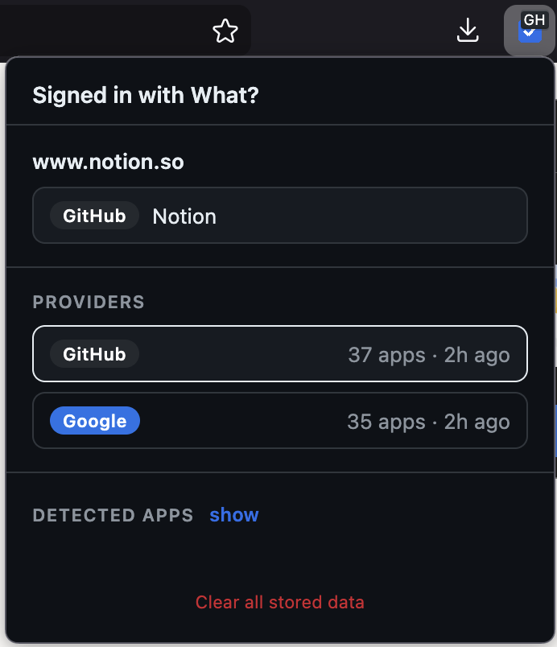

# Signed in with What?

Firefox extension that tells you whether you've previously authorized the current
site via "Sign in with GitHub" or "Sign in with Google".

## How it works

Those provider pages require authentication and can't be scraped headlessly, so
the extension uses a manual-sync model:

1. Click the toolbar icon for onboarding. It offers one-click buttons that open
   `https://github.com/settings/applications` and
   `https://myaccount.google.com/connections`.
2. On the first visit, a dismissable card appears with a **Sync now** button.
   After one successful sync the card is replaced by a small re-sync pill in
   the corner that can be hidden.
3. The scraper reads the authorized apps, resolves each app's homepage, and
   stores the list in `browser.storage.local`.

While you browse, the background script matches the current tab's hostname
against the stored list and sets a toolbar badge (`GH`, `G`, or a count). Click
the toolbar icon to see which provider(s) and which app(s) matched.

## Install (temporary, for development)

1. Open `about:debugging#/runtime/this-firefox` in Firefox.
2. Click **Load Temporary Add-on…**
3. Select `manifest.json` in this directory.

The extension stays loaded until Firefox restarts.

## Files

- `manifest.json` — MV3 manifest
- `background.js` — badge + matching logic, storage, messaging
- `scrapers/ui.js` — shared shadow-DOM overlay/pill rendered on provider pages
- `scrapers/github.js` — content script for GitHub authorized apps
- `scrapers/google.js` — content script for Google connections
- `popup.html` / `popup.js` / `popup.css` — toolbar popup (onboarding + status)
- `icons/` — toolbar icons

## Limitations

- Google's account UI is heavily obfuscated; the scraper looks for external
  anchor links and hostname-like strings near headings. If Google changes the
  layout the scraper may need to be updated.
- Matching is hostname-based. Apps whose homepage differs from the site you
  actually log in to won't match. You can extend stored entries in
  `browser.storage.local` manually if needed.
- Only GitHub and Google providers are supported initially.

## Privacy

Nothing leaves your browser. See [PRIVACY.md](PRIVACY.md).

## License

MIT — see [LICENSE](LICENSE).
